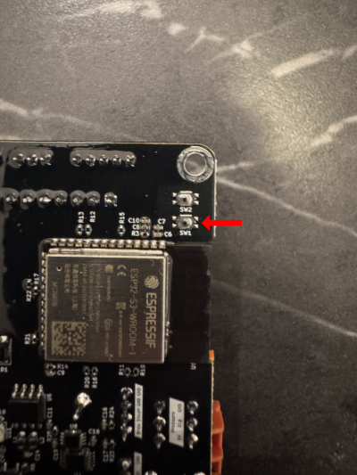

The flashing process of your new components is simply done on this website. You need to use either Chrome, Edge or Opera (Chromium based browsers) for it to work. Simply plug in your devices to USB and press the correct button below.

**Notice**: When you flash these for the first time you might have to start them in Bootloader mode. To do this simply hold the BOOT button labeled SW1 while plugging them into USB.

<esp-web-install-button manifest="/manifests/display-manifest.json">
    <button slot="activate" class="bg-gray-50 border border-[#b0b3b8] border-opacity-40 hover:bg-gray-200 text-gray-700 focus:outline-none focus:ring-4 focus:ring-gray-200 rounded-full px-5 py-3 mr-2 gap-3 items-center text-center">Flash Display</button>
</esp-web-install-button>
<esp-web-install-button manifest="/manifests/controller-manifest.json">
    <button slot="activate" class="bg-gray-50 border border-[#b0b3b8] border-opacity-40 hover:bg-gray-200 text-gray-700 focus:outline-none focus:ring-4 focus:ring-gray-200 rounded-full px-5 py-3 mr-2 gap-3 items-center text-center">Flash Controller</button>
</esp-web-install-button>

Disclaimer: The Web-based flash tool and OTA update are currently built only for the suggested components. (ESP32-S3 N8R8 and LilyGo Display).
This software will also run on other configurations, but you will have to adjust the platformio build and flash those via USB.
