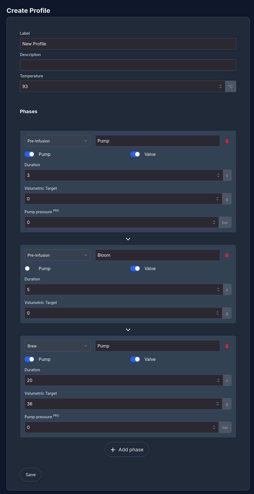
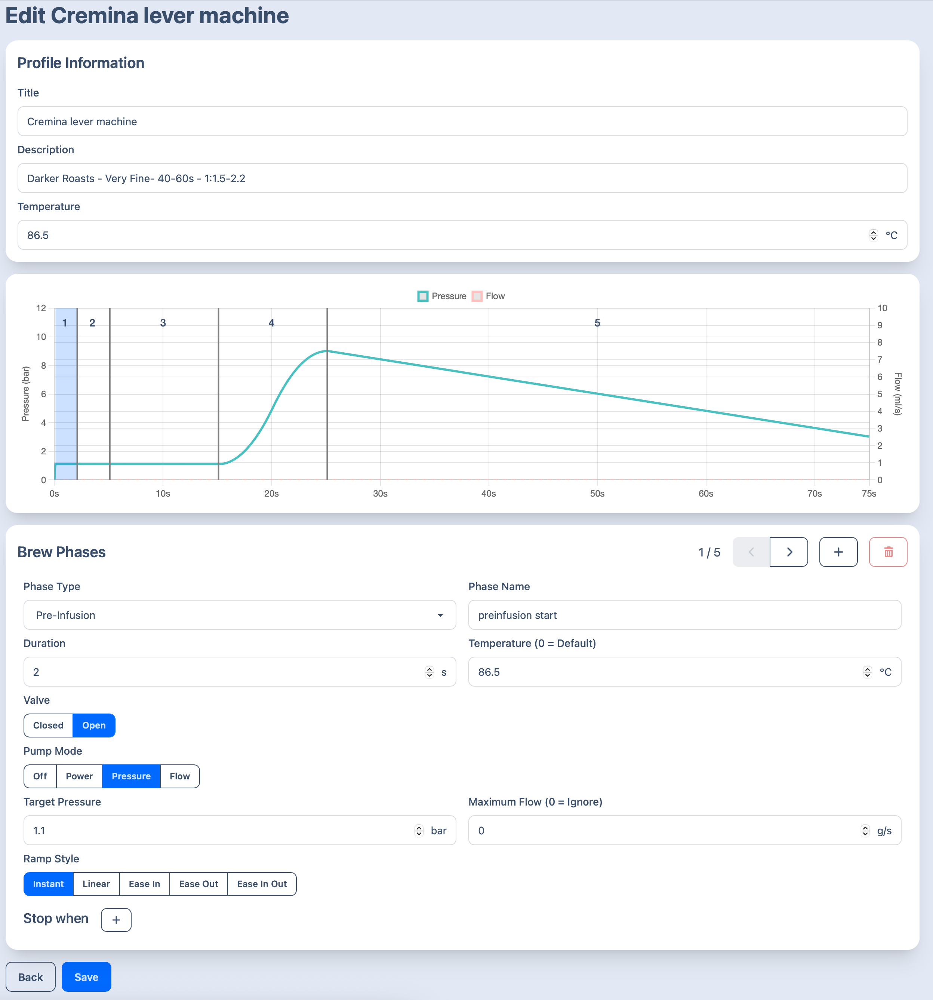

## Introduction

One of Gaggimate's primary features is its ability to create custom profiles for espresso brewing.
Profiles can be created and edited in the web UI on the [Profiles page](http://gaggimate.local/profiles).
Additionally, users can export existing profiles as JSON files, share these files online (see for example the [profiles channel](https://discord.com/channels/951416527721230336/1380352847387820082) on the Discord server), and import other users' profiles onto their own Gaggimate.
Once a profile is created or imported, it can be made available on the machine by favoriting it in the web UI.

A profile consists of one or more *phases*; steps that Gaggimate will execute until it reaches a volumetric target, up to some maximum duration.
Once the target weight is met or the maximum duration is exceeded, Gaggimate will continue to the next phase, or, if there are none left, finish the brew.
Alternately, if the user wishes to stop a brew early, they can simply terminate it manually, either with the on-screen controls, or, if they wired them up, with the physical brew button.

Volumetric targets work best when a Bluetooth scale is used.
If not, Gaggimate will estimate the amount of coffee in the cup based on the pressure curve of the brew up to that point.
Volumetric targets can alternatively have a value of zero grams, in which case this target is treated as infinite and the phase simply runs for the maximum duration of that phase.

During a phase, the machine's pump may be on or off, and the three-way valve may be open or closed.
Users of Gaggimate Pro may also configure the pump to run at a specific pressure, to which it is tuned using the pressure transducer.
For brew recipes, the three-way valve typically remains closed, but opening it can be useful in certain cases, such as for a profile for backflushing.

A profile currently has a single target temperature across all phases. The ability to set declining temperature targets will be coming with the advanced profiles.

## Creating a simple profile

Let's now create a simple profile using the web UI, and see what the corresponding JSON file looks like.
You can also manually write the profiles as JSON files and then import them into Gaggimate if you prefer.

### Using the web UI
At the bottom of the "Profiles" page in the web UI, click "Add new" at the bottom of the page, then select "Simple profile".
Advanced profiles featuring temperature gradients and transitions will follow soon.
We are then presented with the following blank profile:



This will create a profile that performs a three second fill, then a 5 second pre-infusion, and then brew until 36 grams of coffee has been brewed.
The temperature target is 93 °C.
Every phase can be given a descriptive name, which will be shown on the machine's display during the brew.

Save the profile.
When we now return to the page with all profiles, the new profile will appear in the list.
However, it is not yet available on the machine itself.
In order to do so, click the left star icon on the profile to make it available on the machine.
You are now ready to brew some coffee.

## Creating a Pro profile

If you have installed GaggiMate Pro you can also create a Pro profile, this allows for further visualization, multiple stop conditions, transitions between phases and more.

### Using the Web UI

To create a Pro profile, simply select the Pro option when creating a new profile. Below you can see how editing the Cremina Lever profile would look.



At the top you have the basic profile settings, followed by a visualization of the entire profile. At the bottom you can edit the specific phases.
You can change through the phases using the arrow buttons at the right top of the Brew phases section. 

For each phase you set which type and name it should have, the maximum duration of the phase (if there's stop conditions, it will stop when either the duration or any of the conditions are reached) and a temperature override for that phase.
Next you should select if you want the Valve to be open (you usually want that) and in which mode to run the pump.
If you select Power, you will have to enter the percentage at which to run the pump, if you select Pressure or Flow, you will have to enter the target flow/pressure and can optionally enter a flow/pressure limit.

For the transition between phases, you can select different ramp styles, their duration and whether to start the ramp at the previous phases target or at the current value.
For example: Phase 1 targets 3 bar but the machine only reaches 2 bar during that phase. Phase 2 does a linear ramp up to 7 bar. If the ramp should start at the previous target, it will ramp from 3 up to 7 bar. If it should start at the current value, it will ramp from 2 to 7 bar instead.

The final phase setting is stop conditions, here you can select multiple stop conditions for each phase:

**Water pumped**
This will exit when x ml of water was pumped in the current phase. For example you could exit the pre-infusion after 40ml of water went into the puck.

**Weight above**
This will exit when the current weight from the scale is above the set value. It's mostly used to define the shot target.

**Pressure above**
Exit when the boiler pressure goes above the set value.

**Pressure below**
Exit when the boiler pressure drops below the set value

**Flow above**
Exit when the pump flow goes above the set value

**Flow below**
Exit when the pump flow drops below the set value

### The JSON format

By exporting the profile we just created and looking at the contents of the JSON file, the structure of these profiles will become apparent:

```json
{
  "label": "Gagne",
  "type": "pro",
  "description": "",
  "temperature": 92,
  "phases": [
    {
      "name": "5ml/s",
      "phase": "preinfusion",
      "valve": 1,
      "duration": 4,
      "temperature": 0,
      "transition": {
        "type": "instant",
        "duration": 0,
        "adaptive": true
      },
      "pump": {
        "target": "flow",
        "pressure": 1,
        "flow": 5
      }
    },
    {
      "name": "2ml/s",
      "phase": "preinfusion",
      "valve": 1,
      "duration": 4,
      "temperature": 0,
      "transition": {
        "type": "instant",
        "duration": 0,
        "adaptive": true
      },
      "pump": {
        "target": "flow",
        "pressure": 1,
        "flow": 2
      }
    },
    {
      "name": "Ramp",
      "phase": "brew",
      "valve": 1,
      "duration": 3,
      "temperature": 0,
      "transition": {
        "type": "instant",
        "duration": 0,
        "adaptive": true
      },
      "pump": {
        "target": "pressure",
        "pressure": 9,
        "flow": 0
      },
      "targets": [
        {
          "type": "pressure",
          "operator": "gte",
          "value": 9
        }
      ]
    },
    {
      "name": "Hold 9 bar",
      "phase": "brew",
      "valve": 1,
      "duration": 6,
      "temperature": 0,
      "transition": {
        "type": "instant",
        "duration": 0,
        "adaptive": true
      },
      "pump": {
        "target": "pressure",
        "pressure": 9,
        "flow": 4
      }
    },
    {
      "name": "Adaptive Flow",
      "phase": "brew",
      "valve": 1,
      "duration": 30,
      "temperature": 0,
      "transition": {
        "type": "instant",
        "duration": 0,
        "adaptive": true
      },
      "pump": {
        "target": "flow",
        "pressure": 9,
        "flow": -1
      },
      "targets": [
        {
          "type": "volumetric",
          "operator": "gte",
          "value": 36
        }
      ]
    }
  ]
}
```

## Sharing profiles

Profiles can be imported and exported on the overview page. The import feature is located on the top right of the page and every profile card will have an export symbol on the right side.
Profiles provided on this page or on our Discord server in the #profiles channel will come as a .json file which can then be uploaded to GaggiMate on the Web UI.

## Profile recommendations

### Cremina Lever by Johnyez

**Recommendations**:

Roast: Medium-Dark to Very Dark  
Grind: 4 on DF64  
Texture: Lots of crema, traditional  
Time: 40-60s  
Ratio: 1:1.5 - 1:2.2  
Temperature: 78-90 (increase/decrease it by 1 or 2ºC at a time until your preferred flavor, varies by roast)  

<a href="/downloads/profiles/cremina-lever.json" download>Download</a>

### Medium 18g 1:2 by alexr1525

This profile is a relatively simple one that starts with a pre-infusion and bloom and then uses a 9 bar pressure phase with a decline at the end.

<a href="/downloads/profiles/medium-18g.json" download>Download</a>

### Backflush profile

This profile can be used to backflush your machine with Cafiza.

Add the cleaner to a blind basket as specified on the product instructions and run the profile. After it's finished, clean out the blind basket and wipe the group head then run the profile another time to remove any cleaner residue from the machine.

<a href="/downloads/profiles/backflush.json" download>Download</a>
